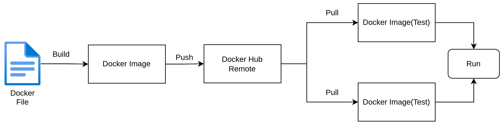

# Task 1/40 — Docker Architecture Diagram 🚀

This is my first task from the #40DaysOfKubernetes challenge.

For this task, I learned the basic workflow of Docker and created a simple Docker Architecture Diagram to understand how Docker images are built, pushed, pulled, and executed.

---

## 📌 Topics Covered

- Dockerfile
- Docker Image
- Docker Hub
- Pull & Push Workflow
- Running Containers

---

## 🖼️ Docker Architecture Diagram

---

## 🧠 What I Understood

From this task, I understood the basic Docker workflow:

1. A `Dockerfile` is used to build a Docker Image.
2. The image can be pushed to Docker Hub.
3. Other systems can pull the same image from Docker Hub.
4. Containers run using the pulled Docker image.

This architecture helps developers maintain consistency across different environments.

---

## 🔖 Hashtags

`#40daysofkubernetes` `#Docker` `#Kubernetes` `#DevOps`
