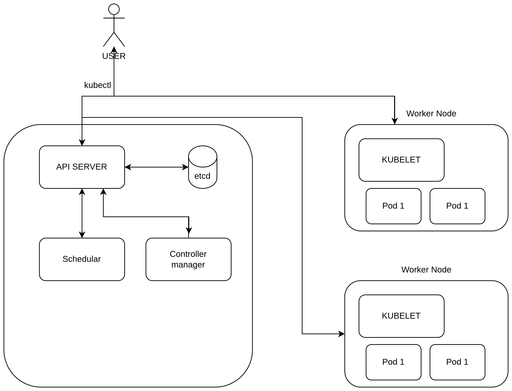

# Task 5/40 — Kubernetes Architecture 🚀

In this task, I learned the basic Kubernetes Architecture and understood how Kubernetes components work together to manage containerized applications.

I also created a Kubernetes Architecture Diagram and explored the end-to-end workflow of a `kubectl` command.

---

# ☸️ Kubernetes Architecture Diagram



---

# 🧠 What Happens When We Run a Kubectl Command?

Example:

```bash
kubectl apply -f deployment.yaml
```

## Step-by-Step Flow

### 1️⃣ User Executes Kubectl Command

The user interacts with the Kubernetes cluster using `kubectl`.

Example:

```bash
kubectl get pods
```

---

### 2️⃣ API Server Receives the Request

The API Server acts as the main entry point of Kubernetes.

Responsibilities:
- Receives all cluster requests
- Validates requests
- Communicates with other components

---

### 3️⃣ etcd Stores Cluster Data

`etcd` is the Kubernetes database.

Responsibilities:
- Stores cluster state
- Stores configurations
- Stores deployment details
- Maintains desired state information

---

### 4️⃣ Scheduler Selects Worker Node

The Scheduler decides where the pod should run.

Responsibilities:
- Finds available worker nodes
- Checks CPU and memory availability
- Assigns pods to suitable nodes

---

### 5️⃣ Controller Manager Maintains Desired State

The Controller Manager continuously checks cluster health.

Responsibilities:
- Ensures desired number of pods are running
- Recreates failed pods
- Monitors cluster state

---

### 6️⃣ Kubelet Runs Pods on Worker Node

Kubelet runs on every worker node.

Responsibilities:
- Receives instructions from API Server
- Pulls container images
- Starts containers inside pods
- Reports node status

---

### 7️⃣ Pod Starts Running

Containers are finally executed inside Pods on worker nodes.

---

# ⚙️ Kubernetes Control Plane Components

---

# 🔹 API Server

The API Server is the central communication hub of Kubernetes.

Functions:
- Accepts kubectl commands
- Validates API requests
- Connects all Kubernetes components

Simple Understanding:
> API Server is the “main door” of Kubernetes.

---

# 🔹 etcd

`etcd` is a distributed key-value database.

Functions:
- Stores cluster data
- Maintains desired state
- Saves configuration information

Simple Understanding:
> etcd is the “brain memory” of Kubernetes.

---

# 🔹 Scheduler

The Scheduler decides where pods should run.

Functions:
- Selects worker nodes
- Monitors resources
- Balances workloads

Simple Understanding:
> Scheduler is the “decision maker” for pod placement.

---

# 🔹 Controller Manager

The Controller Manager continuously monitors the cluster.

Functions:
- Maintains desired state
- Restarts failed pods
- Handles replication

Simple Understanding:
> Controller Manager is the “health monitor” of Kubernetes.

---

# 🔹 Kubelet

Kubelet runs on each worker node.

Functions:
- Starts containers
- Communicates with API Server
- Monitors pod health

Simple Understanding:
> Kubelet is the “worker agent” inside each node.

---

# 📦 What is a Pod?

A Pod is the smallest deployable unit in Kubernetes.

A pod can contain:
- One container
- Multiple related containers

Example:
- Nginx container inside a Pod

Simple Understanding:
> Pod acts like a wrapper around containers.

---

# 🐳 What is a Container?

A container is a lightweight package that contains:
- Application code
- Dependencies
- Libraries
- Runtime environment

Containers help applications run consistently across environments.

Example:
- Docker container running a Node.js app

---

# 📚 Key Learnings

- Kubernetes automates container orchestration
- API Server is the central entry point
- etcd stores cluster information
- Scheduler selects worker nodes
- Kubelet manages pods on worker nodes
- Pods are the smallest Kubernetes deployment unit

---

# 🎯 Conclusion

This task helped me understand the overall Kubernetes Architecture and the interaction between control plane and worker node components.

I also learned how Kubernetes manages containers efficiently using pods, kubelet, scheduler, and controller components.

---

# 📖 References

- Kubernetes Official Documentation
- Tech Tutorials With Piyush Kubernetes Series

---

# 🔖 Tags

`#40daysofkubernetes` `#Kubernetes` `#Docker` `#DevOps` `#CloudNative`
